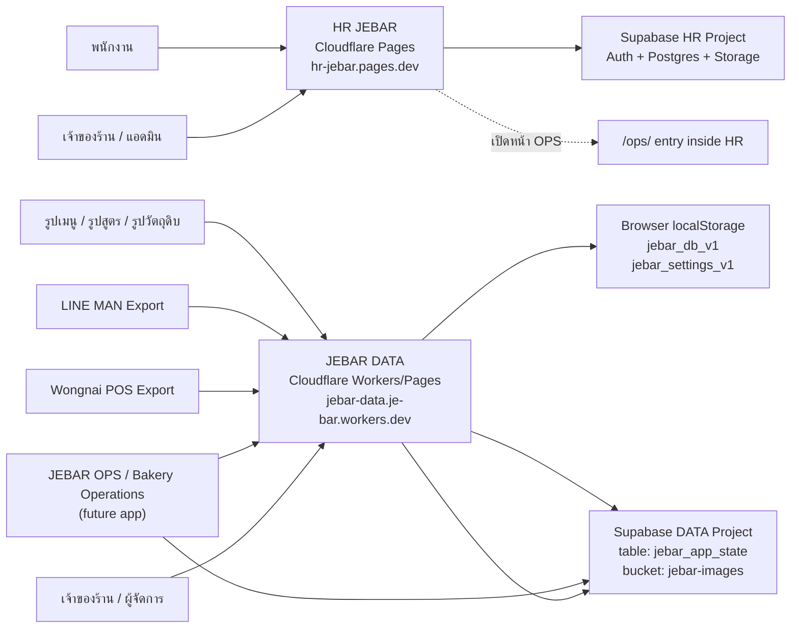
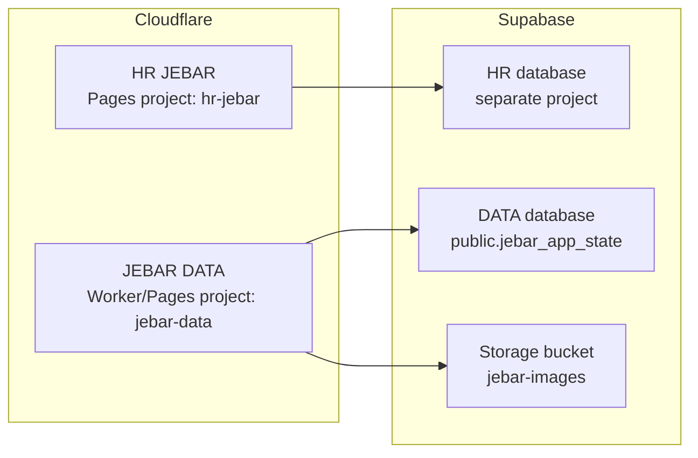
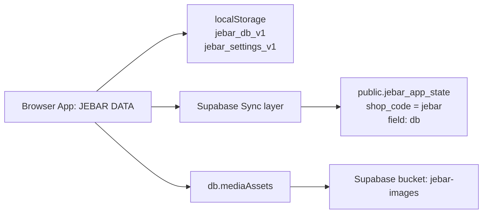
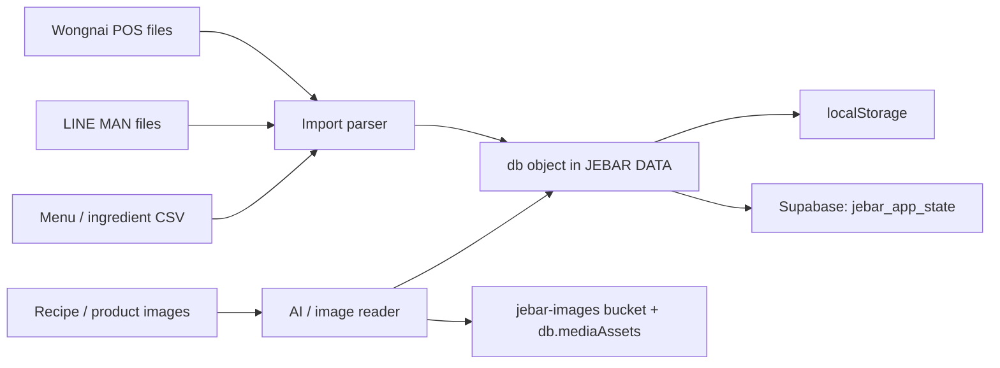
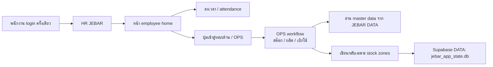
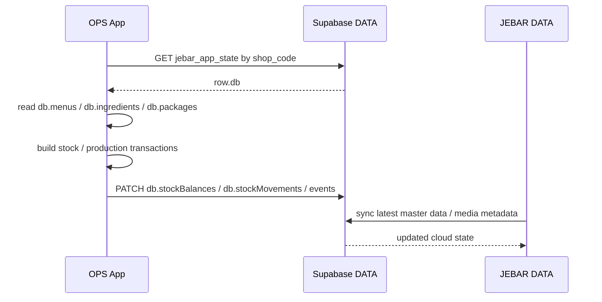

# JEBAR Architecture Diagram

Updated: 2026-06-12

ไฟล์นี้ใช้สรุปภาพรวมสถาปัตยกรรมของระบบ JEBAR ปัจจุบัน และทิศทางการเชื่อม HR + DATA + OPS ในอนาคต

---

## 1. High-level Architecture

---

## 2. Data Ownership

```mermaid
flowchart TB
    DATAOWNER["JEBAR DATA = เจ้าของข้อมูล master data"]
    HROWNER["HR JEBAR = เจ้าของข้อมูลพนักงาน/เวลาเข้างาน"]
    OPSOWNER["OPS = เจ้าของข้อมูลปฏิบัติการสต๊อกบางส่วน"]

    DATAOWNER --> D1["เมนู<br/>db.menus"]
    DATAOWNER --> D2["วัตถุดิบ / supplies<br/>db.ingredients"]
    DATAOWNER --> D3["แพ็กเกจ<br/>db.packages"]
    DATAOWNER --> D4["สูตรตรง<br/>db.recipeBase"]
    DATAOWNER --> D5["สูตรฐานเบเกอรี่<br/>db.batchRecipes<br/>db.batchRecipeLines"]
    DATAOWNER --> D6["ลิงก์สูตรเมนู -> สูตรฐาน<br/>db.recipeBatch"]
    DATAOWNER --> D7["รูปภาพ metadata<br/>db.mediaAssets"]
    DATAOWNER --> D8["ยอดขาย / รายงาน / AI context"]

    HROWNER --> H1["พนักงาน"]
    HROWNER --> H2["PIN / session"]
    HROWNER --> H3["attendance / OT / leave / payroll"]

    OPSOWNER --> O1["stockBalances"]
    OPSOWNER --> O2["stockMovements"]
    OPSOWNER --> O3["purchaseEvents"]
    OPSOWNER --> O4["productionEvents"]
    OPSOWNER --> O5["wasteEvents"]
    OPSOWNER --> O6["integrationInbox / integrationOutbox"]
```

---

## 3. Runtime and Deployment Architecture

---

## 4. JEBAR DATA Internal Storage Flow

---

## 5. Import Flow

---

## 6. Future Unified Employee App Flow

---

## 7. Direct Integration Contract for OPS

---

## 8. Canonical Storage Paths

- HR app code:
  - `C:\Users\TEST_Lenovo\HR-JEBAR\app`
- JEBAR DATA app output:
  - `C:\Users\TEST_Lenovo\Documents\Codex\2026-06-06\jebar-data-https-gorgeous-hamster-dfb363\outputs\jebar-data`
- DATA local browser keys:
  - `jebar_db_v1`
  - `jebar_settings_v1`
- DATA online table:
  - `public.jebar_app_state`
- DATA image bucket:
  - `jebar-images`

---

## 9. Rules We Should Keep

1. `JEBAR DATA` เป็นเจ้าของ master data
2. `HR JEBAR` เป็นเจ้าของข้อมูลคนและเวลา
3. `OPS` อ่าน master data จาก DATA โดยตรง
4. `OPS` เขียนกลับได้เฉพาะ stock zones
5. รูปทั้งหมดต้องอ้างผ่าน `db.mediaAssets` และเก็บไฟล์จริงใน `jebar-images`
6. การรวมแอปพนักงานควรเป็น single login แต่ยังแยก ownership ของข้อมูลแต่ละโดเมน

---

## 10. Recommended Next Diagram

ถ้าต้องการต่อจากไฟล์นี้ แนะนำทำเพิ่มอีก 2 แผนภาพ:

1. `LOGIN_FLOW_JEBAR.md`
   - แยก owner / admin / employee / ops access

2. `DATA_MODEL_DIAGRAM_JEBAR.md`
   - แสดง relation ระหว่าง `menus`, `ingredients`, `recipeBase`, `batchRecipes`, `recipeBatch`, `mediaAssets`, `stockBalances`

