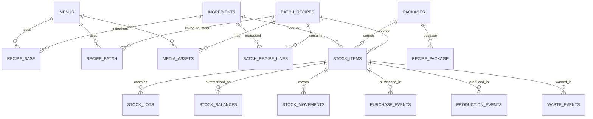
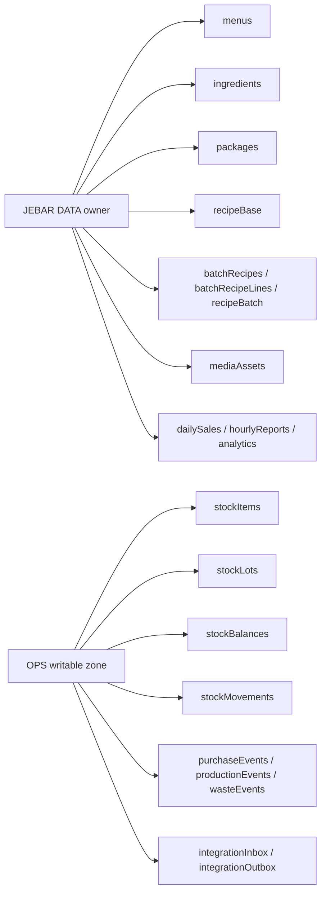

# JEBAR Data Model Diagram

Updated: 2026-06-12

เอกสารนี้สรุปโครงสร้างข้อมูลหลักของ JEBAR DATA เพื่อใช้คุยกับทีม HR, OPS และนักพัฒนาระบบอื่น

---

## 1. Core Business Data Model



---

## 2. Main JSON Root

Primary storage object:

- `db`

Main root arrays:

- `db.menus`
- `db.ingredients`
- `db.packages`
- `db.recipeBase`
- `db.recipePackage`
- `db.recipeBatch`
- `db.batchRecipes`
- `db.batchRecipeLines`
- `db.dailySales`
- `db.hourlyReports`
- `db.menuReports`
- `db.mediaAssets`
- `db.activityLogs`
- `db.stockItems`
- `db.stockLots`
- `db.stockBalances`
- `db.stockMovements`
- `db.purchaseEvents`
- `db.productionEvents`
- `db.wasteEvents`
- `db.integrationInbox`
- `db.integrationOutbox`

---

## 3. Menus

Path:

- `db.menus`

Purpose:

- รายการเมนูขายจริง
- ใช้เป็น master code สำหรับยอดขาย สูตร และ OPS

Suggested fields:

```text
id
name
category
type
priceStore
priceLine
status
```

Examples:

- `COF001`
- `BAK001`
- `DST001`

---

## 4. Ingredients and Supplies

Path:

- `db.ingredients`

Purpose:

- วัตถุดิบหลัก
- ของใช้สิ้นเปลือง
- cleaning supplies
- packaging consumables ที่ต้องการอยู่ใน data กลาง

Suggested fields:

```text
id
name
category
unit
buyPrice
buyQty
yield
costPerUnit
status
```

Examples:

- `ING001` เมล็ดกาแฟ
- `ING002` นมสด
- `SUP001` น้ำยาล้างจาน
- `SUP002` ทิชชู่

Rule:

- supplies ไม่ต้องมี master แยกอีกระบบ
- ถ้าจะใช้ใน OPS ให้ดึงจาก `db.ingredients` โดยตรง

---

## 5. Packages

Path:

- `db.packages`

Purpose:

- แก้ว กล่อง ฝา ถุง สติ๊กเกอร์ บรรจุภัณฑ์

Suggested fields:

```text
id
name
type
unit
buyPrice
buyQty
costPerPiece
status
```

---

## 6. Direct Menu Recipe Model

Path:

- `db.recipeBase`
- `db.recipePackage`
- `db.recipeOption`

### `db.recipeBase`

Use for:

- เมนูเครื่องดื่ม
- เมนูที่ใช้วัตถุดิบตรง ๆ

Fields:

```text
menuId
ingId
qty
unit
costPerUnit
lineCost
```

### `db.recipePackage`

Use for:

- ต้นทุนบรรจุภัณฑ์ต่อเมนู

Fields:

```text
menuId
pkgId
qty
unit
costPerPiece
lineCost
```

---

## 7. Bakery Base Recipe Model

Paths:

- `db.batchRecipes`
- `db.batchRecipeLines`
- `db.recipeBatch`

### `db.batchRecipes`

Purpose:

- สูตรฐานที่ผลิตเป็น batch ก่อน
- เช่น เนื้อเค้ก, โดว์ขนมปัง, ครีม, ไส้

Fields:

```text
id
name
category
outputQty
outputUnit
note
```

### `db.batchRecipeLines`

Purpose:

- วัตถุดิบภายในสูตรฐาน

Fields:

```text
batchId
ingId
qty
unit
costPerUnit
lineCost
```

### `db.recipeBatch`

Purpose:

- ลิงก์เมนูขาย -> สูตรฐาน
- ใช้ scale ต้นทุนจากสูตรฐานเข้าสู่เมนู

Fields:

```text
menuId
batchId
qty
unit
costPerUnit
lineCost
```

Example concept:

- `BAT001` เนื้อเค้ก red velvet 1000 g
- เมนู `COF051` หรือ `CAK010` ใช้ `BAT001` ปริมาณ 120 g

---

## 8. Sales Data

### Daily sales

Path:

- `db.dailySales`

Purpose:

- รายได้ต่อวัน
- ใช้ dashboard, analytics, AI

Fields:

```text
date
store
line
other
posTotal
bills
lineBills
branch
```

Important rule:

- `store = posTotal - line`
- ห้ามนับ LINE MAN ซ้ำในหน้าร้าน

### Hourly reports

Path:

- `db.hourlyReports`

Purpose:

- ใช้เฉพาะวิเคราะห์รายชั่วโมง
- ไม่ใช้คำนวณ top menu

Fields:

```text
date
hour
sales
bills
channel
```

---

## 9. Image Model

Path:

- `db.mediaAssets`

Actual file storage:

- Supabase bucket `jebar-images`

Fields:

```text
id
bucket
path
url
entityType
entityId
role
fileName
mime
size
createdAt
```

### `entityType` examples

- `menu`
- `batchRecipe`
- `ingredient`
- `package`
- `brand`

### `role` examples

- `cover`
- `recipe-photo`
- `reference`
- `logo`

Rule:

- แอปอื่นต้อง lookup รูปผ่าน `db.mediaAssets`
- ห้ามเดาทางไฟล์เองถ้าไม่อ่าน metadata ก่อน

---

## 10. Stock Model for OPS

### Stock item

Path:

- `db.stockItems`

Purpose:

- ตัวเชื่อมระหว่าง master data กับ stock system

Fields:

```text
id
refType
refId
name
unit
status
```

### Stock lots

Path:

- `db.stockLots`

Fields:

```text
id
stockItemId
lotCode
receivedAt
qtyIn
qtyRemaining
unitCost
```

### Stock balances

Path:

- `db.stockBalances`

Fields:

```text
stockItemId
onHand
reserved
available
lastUpdatedAt
```

### Stock movements

Path:

- `db.stockMovements`

Fields:

```text
id
stockItemId
movementType
qty
unit
refType
refId
createdAt
```

### Event arrays

- `db.purchaseEvents`
- `db.productionEvents`
- `db.wasteEvents`

Rule:

- OPS เขียนกลับได้เฉพาะ stock-related arrays เหล่านี้

---

## 11. Integration Lanes

Paths:

- `db.integrationInbox`
- `db.integrationOutbox`

Use for:

- รับงานจากระบบอื่น
- ส่งงานหรือสถานะออกไปยังระบบอื่น

Suggested fields:

```text
id
source or target
eventType
status
createdAt
payload
```

---

## 12. Data Model by Ownership



---

## 13. Safe Read / Write Contract

### External apps may read

- `db.menus`
- `db.ingredients`
- `db.packages`
- `db.recipeBase`
- `db.batchRecipes`
- `db.batchRecipeLines`
- `db.recipeBatch`
- `db.mediaAssets`

### External apps may write back

- `db.stockItems`
- `db.stockLots`
- `db.stockBalances`
- `db.stockMovements`
- `db.purchaseEvents`
- `db.productionEvents`
- `db.wasteEvents`
- `db.integrationInbox`
- `db.integrationOutbox`

### External apps must not overwrite

- `db.menus`
- `db.ingredients`
- `db.packages`
- `db.recipeBase`
- `db.batchRecipes`
- `db.batchRecipeLines`
- `db.recipeBatch`
- `db.mediaAssets`

---

## 14. Recommended Shared ID Contract

```text
COF001  = menu code
CAK001  = cake menu code
BAT001  = bakery base recipe code
ING001  = ingredient code
SUP001  = supply code
PKG001  = package code
```

Rule:

- ทุกแอปต้องใช้รหัสจาก DATA เป็น shared reference
- ห้ามสร้างรหัสใหม่ทับของเดิมใน OPS หรือระบบอื่น

