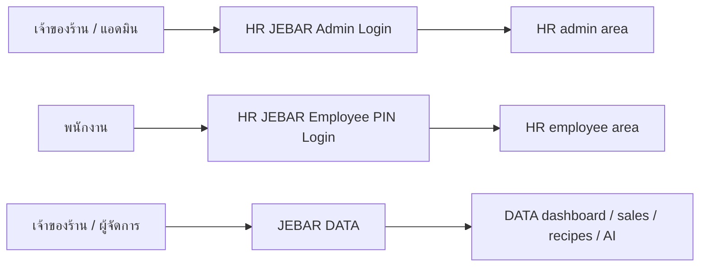
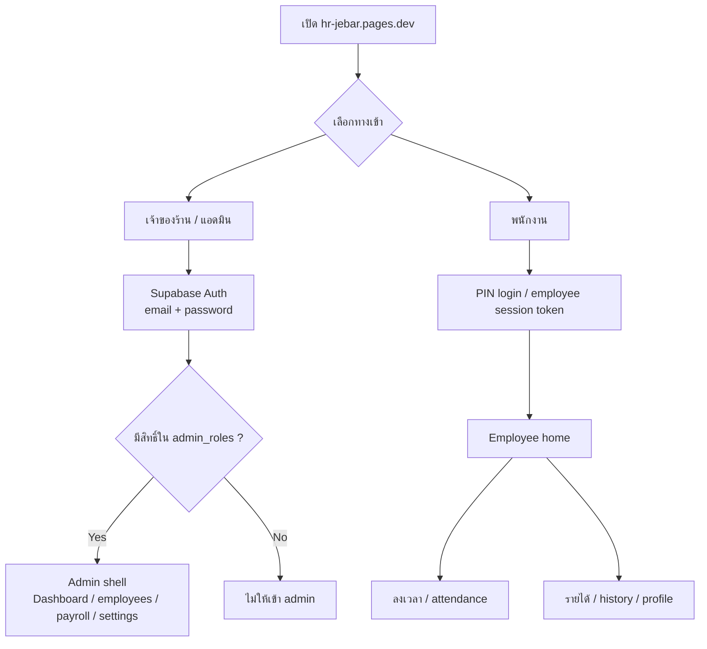
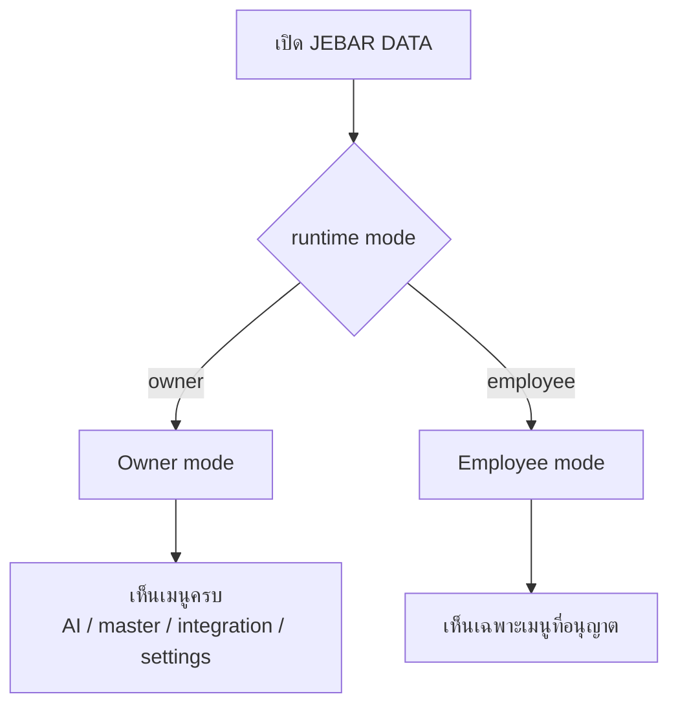
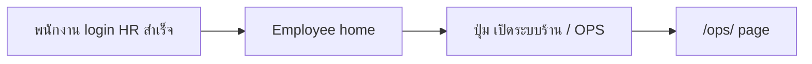
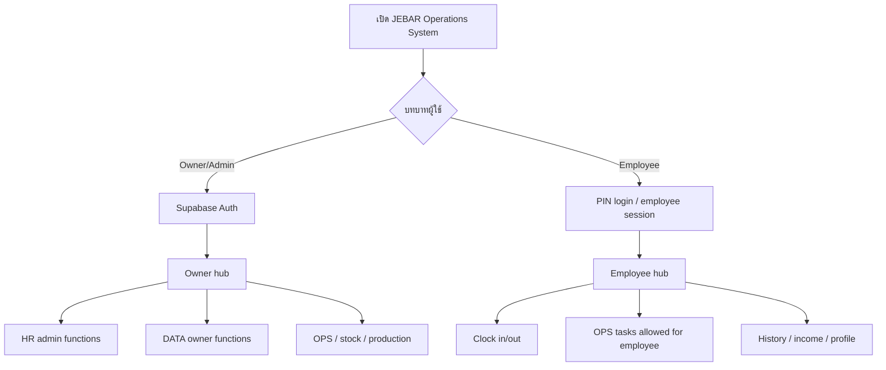
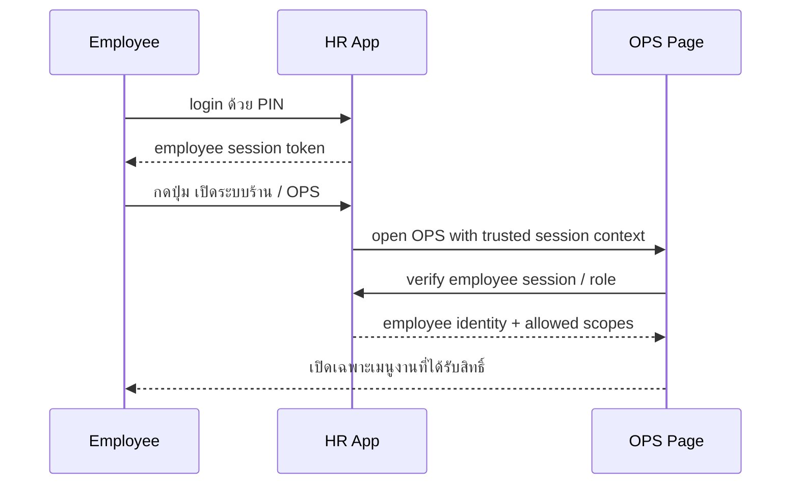

# JEBAR Login Flow

Updated: 2026-06-12

เอกสารนี้อธิบาย flow การเข้าใช้งานของระบบ JEBAR ในปัจจุบัน และแนวทางรวม HR + OPS + DATA ให้ผู้ใช้ login แบบเหมาะกับบทบาท

---

## 1. Current Login Landscape

---

## 2. Current HR Login Flow

---

## 3. Current DATA Access Flow

Key note:

- DATA app ตอนนี้ยังไม่ได้ผูก auth จริง
- ใช้ runtime mode เพื่อซ่อน/แสดงหน้า
- ถ้าจะให้พนักงานใช้จริงใน production ต้องพึ่ง HR เป็นประตูหลัก

---

## 4. Current OPS Entry from HR

ข้อจำกัดตอนนี้:

- `/ops/` เป็น static entry
- ยังไม่ได้ใช้ employee session ของ HR แบบเต็มรูปแบบ
- ถ้าจะให้ปลอดภัยจริง ต้องมี session handshake หรือ route guard จาก HR

---

## 5. Recommended Unified Login Target

---

## 6. Recommended Security Model

### Owner / Admin

- Login ด้วย Supabase Auth ของ HR
- เช็ก role จาก `admin_roles`
- ได้สิทธิ์:
  - HR admin
  - DATA owner pages
  - OPS admin pages

### Employee

- Login ด้วย PIN
- สร้าง session token ของพนักงาน
- ได้สิทธิ์:
  - attendance
  - employee profile
  - OPS เฉพาะงานที่กำหนด
- ไม่มีสิทธิ์:
  - master data
  - pricing
  - integration settings
  - Supabase sync controls

---

## 7. Recommended Integration Gate Between HR and OPS

แนวคิดนี้ดีกว่าการเปิด `/ops/` แบบ public ตรง ๆ

---

## 8. Access Matrix

| Function | Owner/Admin | Employee |
|---|---:|---:|
| HR admin dashboard | Yes | No |
| Employee attendance | Yes | Yes |
| Payroll / deductions | Yes | No |
| JEBAR DATA dashboard | Yes | Limited |
| AI advisor | Yes | No |
| Master data | Yes | No |
| Menu pricing | Yes | No |
| Bakery base formulas | Yes | No |
| OPS stock receive | Yes | Scoped |
| OPS production record | Yes | Scoped |
| OPS waste record | Yes | Scoped |
| Supabase sync button | Yes | No |
| Integration docs | Yes | No |

---

## 9. Recommended Phases

### Phase 1

- HR remains main login app
- Employee enters through HR only
- OPS opens from HR employee page
- DATA remains owner/admin tool

### Phase 2

- OPS reads employee session from HR
- OPS enforces role-based access
- DATA owner screens remain hidden from employees

### Phase 3

- Single brand shell:
  - JEBAR Operations System
- Shared top-level navigation
- HR, OPS, DATA become modules behind one login experience

---

## 10. Implementation Notes

- HR is the best source of identity
- DATA is the best source of business master data
- OPS should be the task workspace for stock / production / wastage
- Do not make DATA the main employee login app
- Do not allow employee direct access to owner sync tools or master edits

